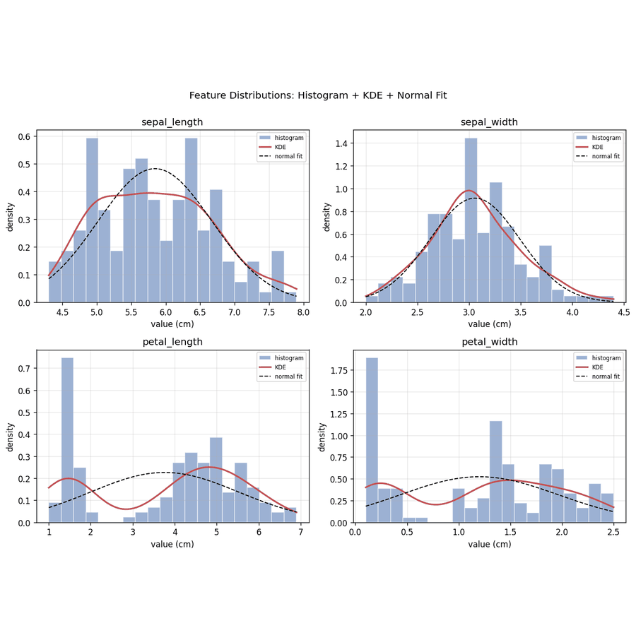

# AI Engineering Workbench

> Coding the mathematical and statistical foundations of AI engineering — from scratch.

A hands-on workbench where I implement the core math and statistics behind machine learning using **NumPy, SciPy, Pandas & Matplotlib** — exploratory data analysis, regression, feature statistics, and supervised learning, all coded from first principles. Every script generates its own publication-style figures, so the math is not just computed — it's visualized.

---

## Highlights

- **Exploratory Data Analysis** — distributions, boxplots by class, scatter matrices, and outlier detection on real datasets
- **Regression & Diagnostics** — linear regression built step by step, with advanced statistical diagnostics (residuals, confidence intervals, hypothesis tests)
- **Feature Statistics** — correlation heatmaps, feature transformations, and engineering pipelines
- **Supervised Learning** — end-to-end workflows from raw data to trained model, including a telco customer dataset case study
- **Reproducible Visuals** — fixed seeds, consistent plot styling, and every figure exported automatically to `figures/`

## Stack

`numpy` · `scipy` · `pandas` · `matplotlib` · `seaborn` · `scikit-learn`

## Why This Repo

Understanding the math behind AI — not just calling `.fit()` — is what separates using models from engineering them. This workbench is where I sharpen that foundation: statistics, regression theory, and data analysis, implemented and visualized by hand.

---

**Ivan Ritchel Orpiano** · AI Automation Engineer
🌐 [iorpiano.site](https://iorpiano.site) · 💼 [LinkedIn](https://www.linkedin.com/in/ivanorpiano/)
